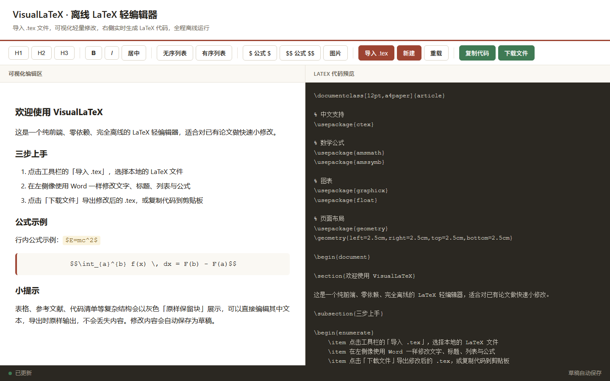

<div align="center">

# VisualLaTeX

**Import · Tweak · Export — an offline LaTeX light editor that never loses a character**

[](https://github.com/Escap1ng/VisualLaTeX/releases)
[](./LICENSE)


[中文](README.md) · **English**

</div>

> **Project Status**: v2.0.0 is the final feature release. The project is now in maintenance mode (critical fixes only, no new features).

---

<div align="center">



</div>

## Why This Exists

It's the night before the deadline, and your advisor only asked you to "change a few sentences and reword a title" — yet the moment you open the `.tex` file, a wall of backslashes and braces stares back at you. Overleaf is great, but it is designed for people who write code. You just want a small, safe change.

**VisualLaTeX was built for exactly that:**

| Scenario | Traditional Code Editor | VisualLaTeX |
|:---|:---|:---|
| Small-edit efficiency | Manually locate structures in source | WYSIWYG, click and edit |
| Risk of breakage | Easy to corrupt commands & environments | Complex structures locked verbatim |
| Learning curve | Requires LaTeX fluency | If you can use Word, you're set |

## Core Workflow

**Import `.tex` → light visual edits → export `.tex`**

Changes only happen where you make them; everything else is preserved character-for-character, fully offline.

## Features

| Feature | Details |
|:---|:---|
| One-click import | Open a local `.tex`; sections, paragraphs, lists, formulas, and images become visual elements |
| Split-pane view | Visual editor on the left, live LaTeX source preview on the right |
| Basic formatting | Three heading levels, bold, italic, center, ordered/unordered lists |
| Formula input | 30+ symbol quick palette, inline `$...$` and display `$$...$$` math |
| Verbatim blocks | Tables, bibliographies, code listings shown as-is, editable, never lost on export |
| Command protection | `\cite`, `\ref`, and other reference commands preserved verbatim |
| Image insertion | Enter a path to generate the `figure` float environment |
| One-click export | Copy source or download `.tex`, reusing the imported file name |
| Auto-save | Drafts cached together with the preamble; content survives page refresh |

## Quick Start

**Zero install · zero dependencies · zero build** — clone and double-click to run offline:

```bash
git clone https://github.com/Escap1ng/VisualLaTeX.git
```

Then double-click `index.html`. That's it.

## Project Structure

```
VisualLaTeX/
├── index.html    # Main page (layout, toolbar)
├── style.css     # Global styles
├── main.js       # Editor core, .tex parsing, DOM↔LaTeX conversion
├── README.md     # Docs (Chinese)
└── README.en.md  # Docs (English)
```

## Recommended Workflow

Import the `.tex` you want to touch up → make visual text and structure adjustments → export and download → drop it back into your project and compile.

<details>
<summary><b>Known Limitations</b></summary>

1. Built on `contenteditable` for simplicity; complex nested layouts may parse incorrectly
2. No visual table editing (tables are edited as source inside verbatim blocks)
3. Edge cases such as nested same-name environments (e.g., itemize inside itemize) may not parse perfectly
4. This is a light editing tool; for large-scale rewrites, use a code editor

</details>

<details>
<summary><b>Version History</b></summary>

- **v2.0.0 (final)**: repositioned as a general offline LaTeX light editor; added .tex import; verbatim preservation of unsupported structures for lossless round-trips; fixed preamble not being cached with drafts and formulas losing user edits
- **v1.1.0**: visual editor + formula assistant for math-modeling papers (removed in v2.0.0)
- **v1.0.0**: initial release

</details>

## Contributing

The project is in maintenance mode; Issue reports and Pull Requests for critical bug fixes are welcome via the [Issue tracker](https://github.com/Escap1ng/VisualLaTeX/issues).

## License

[MIT License](./LICENSE) © Escap1ng

---

<div align="center">

**If this tool saved you an hour, consider leaving a Star**

</div>
